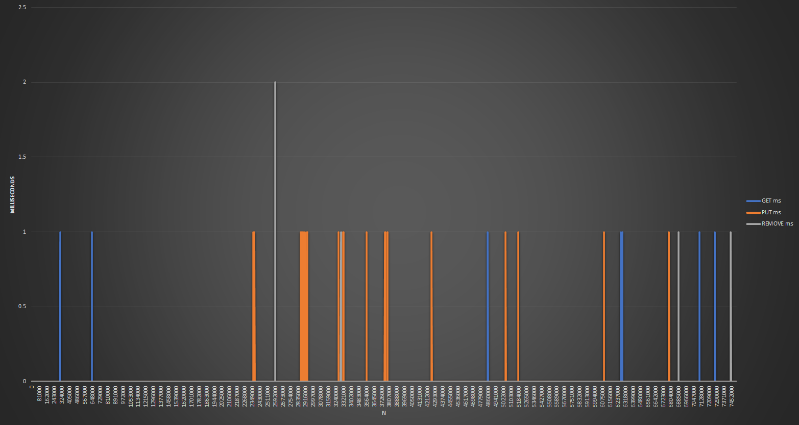

# Red-Black Tree And Hashmap in c++ With Explicit Memory Management
Originally done as a project for my CS 251 (Data Structures) course.
---
It is all designed to be run on Microsoft Windows with MinGW, but can be run on Linux and other operating systems as well, though the Makefile will need some modifications.

Do either:
- `make clean` (remove all .exe files)
- `make timing` (build timing testing program)
- `make interactive` (build interactive red-black tree testing console application)

## Graphs (*Only one for now*):
---

